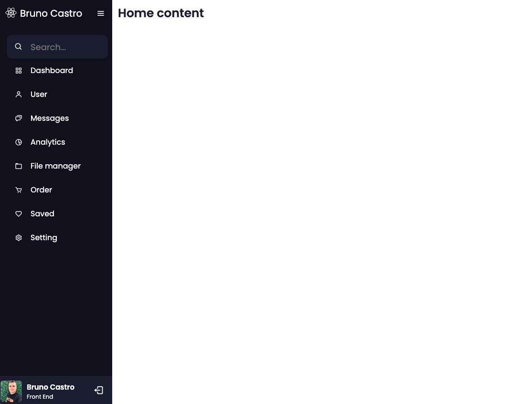
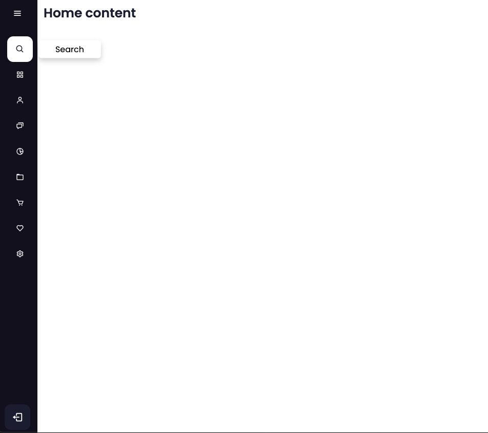

<h1 align="center">
    Sidebar menu responsivo
</h1>

  <a href="#sobre">Projeto</a>&nbsp;&nbsp;&nbsp;|&nbsp;&nbsp;&nbsp;
  <a href="#tecnologias">Tecnologias</a>&nbsp;&nbsp;&nbsp;|&nbsp;&nbsp;&nbsp;
  <a href="#setup">Setup</a>&nbsp;&nbsp;&nbsp;|&nbsp;&nbsp;&nbsp;
  <a href="#layout">Layout</a>&nbsp;&nbsp;&nbsp;|&nbsp;&nbsp;&nbsp;
  <a href="#licença">Licença</a>

 

  

 

## Projeto

Sidebar menu responsivo. Projeto feito em HTML, CSS e JS

## Tecnologias

Esse projeto foi desenvolvido com as seguintes tecnologias:

- [Html](https://www.w3schools.com/html)
- [Css](https://www.w3schools.com/css/default.asp)
- [JavaScript](https://developer.mozilla.org/pt-BR/docs/Web/JavaScript)

## Setup

Clone o repositório em sua máquina:

`git clone https://brunolagoa.github.io/sidebar-menu.git`

Execute o arquivo `index.html`

## Layout

    

  

    

  

Site publicado em:

<a alt="Bruno Castro" target="_blank" rel="noopener noreferrer" href="https://brunolagoa.github.io/sidebar-menu/">Clique aqui para visualizar</a>

---

## Licença

Esse projeto está sob a licença MIT. Veja o arquivo [LICENSE](LICENSE.md) para mais detalhes.

---

<h3 align="center">
Autor: <a alt="Bruno Castro" target="_blank" rel="noopener noreferrer" href="https://brunocastro.dev">Bruno Castro</a>
</h3>

  
  

